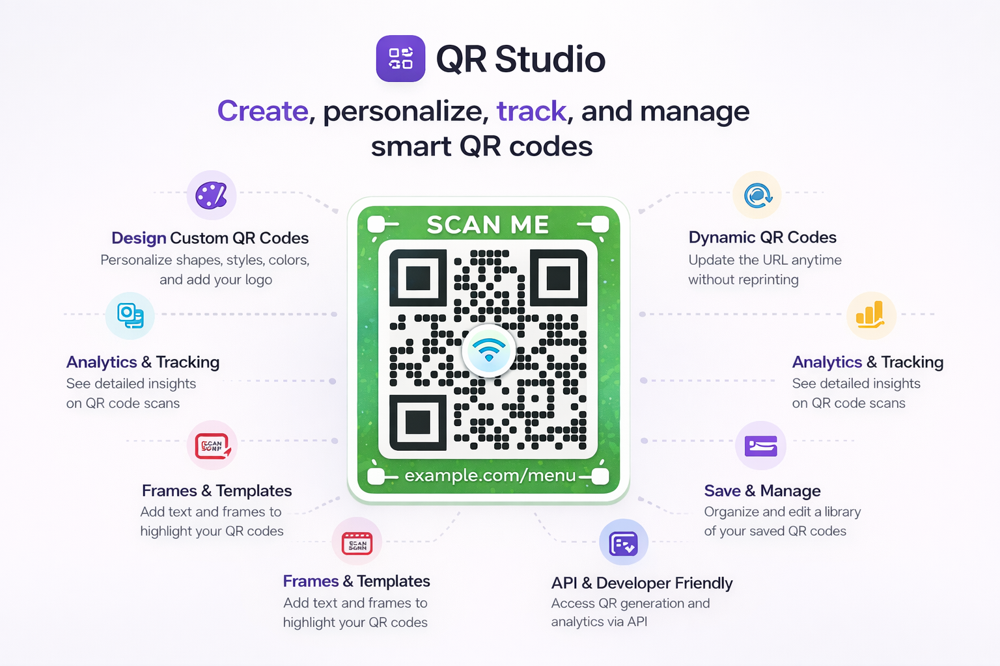
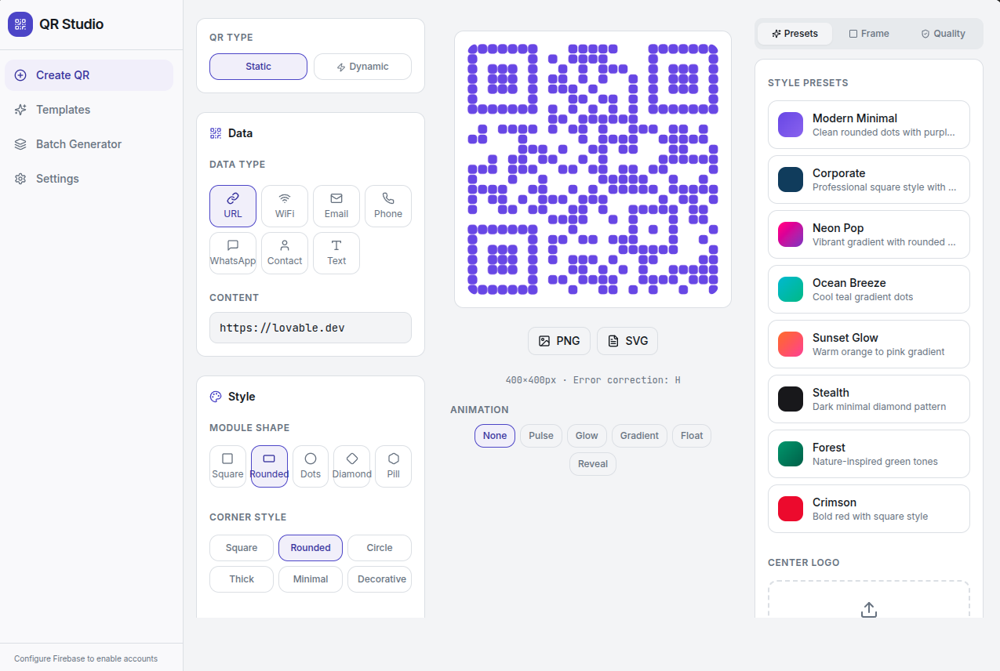
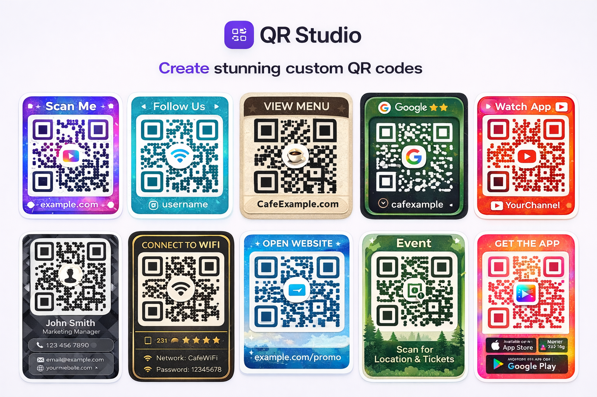

<p align="center">
  
</p>

<h1 align="center">QR Design Studio</h1>

<p align="center">
  Design, customize, export, and manage branded QR codes from one interface.
</p>

<p align="center">
  <a href="#preview-gallery">Preview</a> •
  <a href="#features">Features</a> •
  <a href="#setup">Setup</a> •
  <a href="#firebase-setup">Firebase</a> •
  <a href="#publisher">Publisher</a>
</p>

## Overview

QR Design Studio is a `Vite + React + TypeScript` application for building professional QR codes with live styling controls, export tools, templates, frames, batch generation, and optional Firebase-powered dashboard and analytics features.

> Note: this repository is a `Vite` project, not a Next.js app.

## Preview Gallery

| Main Editor | Design Variations |
| --- | --- |
|  |  |

## Features

### QR Designer

- Create QR codes for `URL`, `email`, `phone`, `WhatsApp`, `plain text`, `WiFi`, and `vCard`.
- Change module shape, corner style, size, colors, gradients, background, transparency, and error correction.
- Upload a center logo and adjust its scale.
- Export QR codes as `PNG` and `SVG`.

### Templates and Styling

- Use ready-made templates for business, communication, hospitality, events, social, finance, and utility use cases.
- Apply style presets quickly.
- Add branded frames with top text, bottom text, colors, padding, and font sizing.
- Preview scan reliability before export or printing.

### Dynamic QR Workflow

- Create static and dynamic QR codes.
- Dynamic QR codes redirect through `/r/:code`.
- Update destinations later without changing the printed QR.
- Track scan activity for dynamic QR codes.

### Dashboard and Analytics

- Sign in with `email/password` or `Google`.
- Save, edit, search, favorite, archive, restore, and delete QR codes.
- View analytics for total scans, unique scans, scan timeline, countries, devices, and recent scan history.

### Batch Generation

- Import `CSV` files using `data,label`.
- Paste multiple values at once.
- Download generated QR codes as a ZIP archive.

## Integrations

- `Firebase Authentication` for sign-in, sign-up, Google auth, and password reset.
- `Cloud Firestore` for saved QR codes, short links, and scan events.
- `Firebase Storage SDK` is initialized for future use.
- `ipapi.co` for country and city lookup during dynamic redirect scans.
- `JSZip` for batch ZIP downloads.

## Tech Stack

- `React 18`
- `TypeScript`
- `Vite`
- `React Router`
- `Tailwind CSS`
- `shadcn/ui`
- `Framer Motion`
- `Recharts`
- `Firebase`
- `Vitest`
- `Playwright` scaffold

## Setup

### Requirements

- `Node.js 18+`
- `npm` or `bun`

### Install

```bash
git clone <your-repo-url>
cd qr-design-studio
npm install
npm run dev
```

Local dev server:

```bash
http://localhost:8080
```

### Scripts

```bash
npm run dev
npm run build
npm run preview
npm run lint
npm run test
```

## Firebase Setup

Firebase is optional if you only want local QR design and export.

Firebase is required for:

- authentication
- saved QR codes
- dynamic redirects
- analytics
- dashboard management

### 1. Environment variables

Copy `.env.example` to `.env.local`:

```bash
cp .env.example .env.local
```

Then fill in:

```env
VITE_FIREBASE_API_KEY=your-api-key
VITE_FIREBASE_AUTH_DOMAIN=your-project.firebaseapp.com
VITE_FIREBASE_PROJECT_ID=your-project-id
VITE_FIREBASE_STORAGE_BUCKET=your-project.appspot.com
VITE_FIREBASE_MESSAGING_SENDER_ID=123456789
VITE_FIREBASE_APP_ID=1:123456789:web:abcdef123456
```

### 2. Enable services

- Enable `Authentication`
- Enable `Email/Password`
- Enable `Google` if needed
- Create `Cloud Firestore`

### 3. Firestore collections

- `qr_codes`
- `short_links`
- `qr_scans`

### 4. Recommended indexes

- `qr_codes`: `userId` ascending, `createdAt` descending
- `qr_scans`: `qrCodeId` ascending, `timestamp` descending

## Notes

- Dynamic QR links use `window.location.origin`, so generate production QR codes from the final deployed domain.
- Batch generation is fully client-side.
- Logo uploads are currently stored as browser data URLs, not Firebase Storage uploads.
- `WiFi` and `vCard` support are intentionally lightweight in the current UI.
- Scan location falls back to `Unknown` if `ipapi.co` is unavailable.

## Publisher

**Moatasem Alhilali**

- GitHub: https://github.com/moatasem-alhilali
